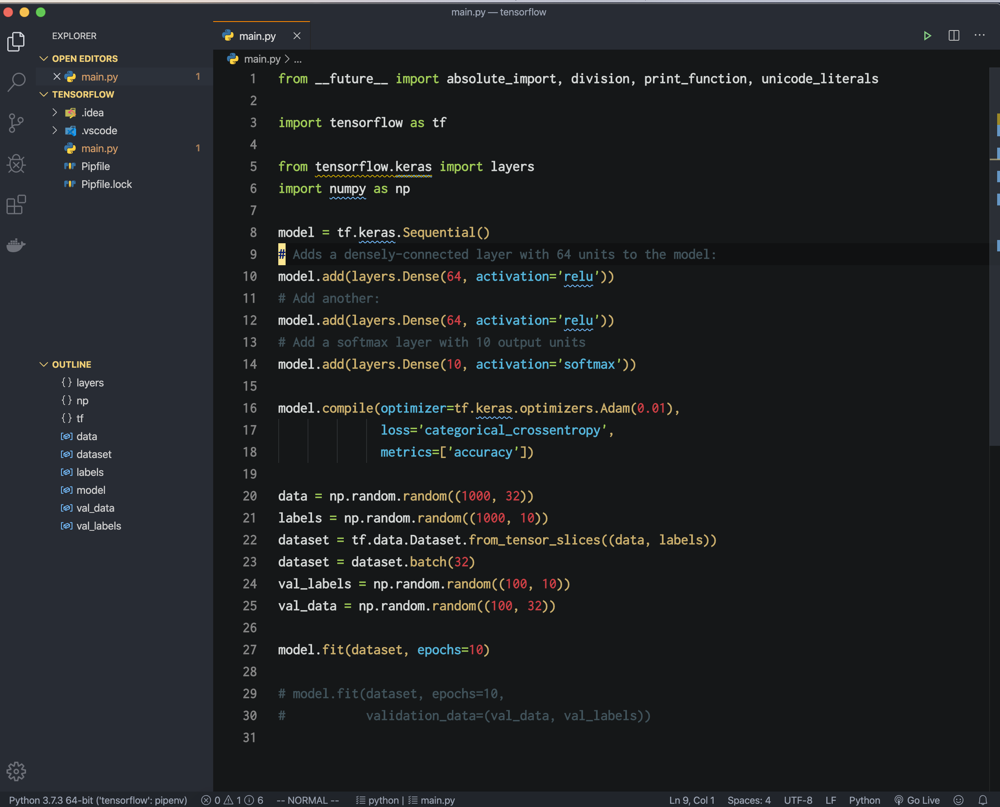

# README

This theme uses One-dark-pro theme for UI, Seti_original for syntax highlighting.

Seti_ui from [https://github.com/jesseweed/seti-ui](https://github.com/jesseweed/seti-ui)

One_dark_pro from [https://github.com/Binaryify/OneDark-Pro](https://github.com/Binaryify/OneDark-Pro)

**Enjoy!**

